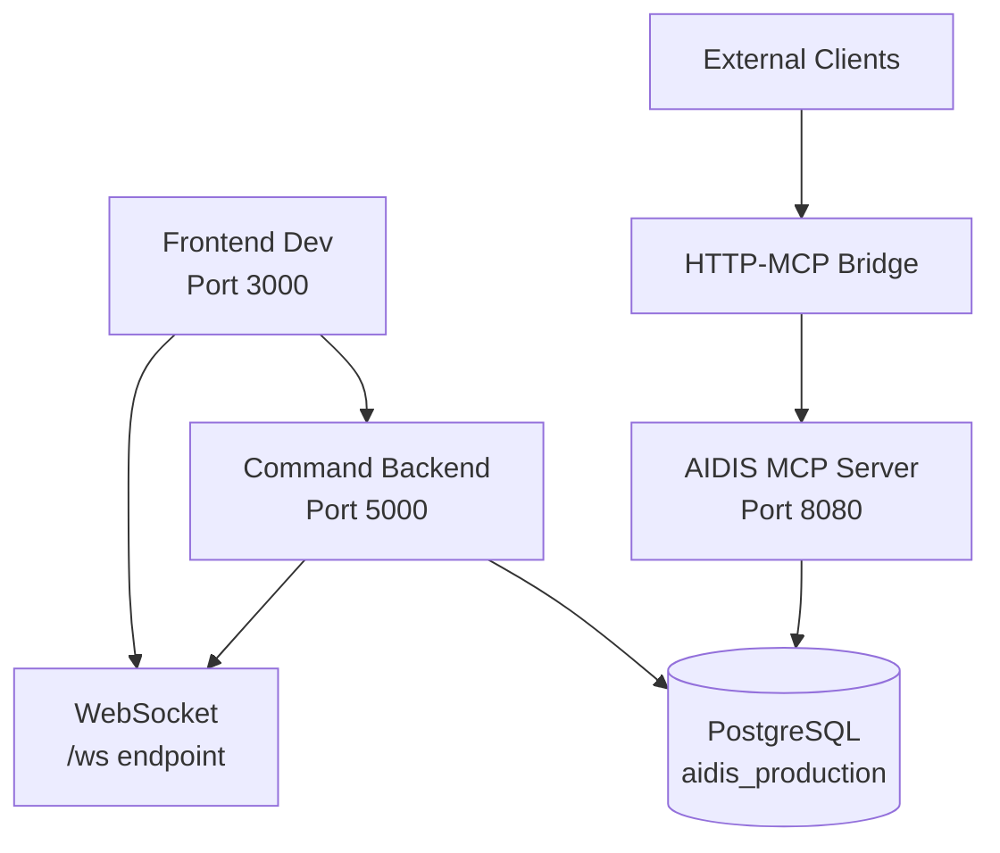

# TR014-4: Service Ownership and Boundaries Documentation
## Oracle Refactor Phase 4 - Service Architecture Definition

**Date**: 2025-09-20
**Task**: TR014-4 - Establish Clear Service Ownership and Boundaries
**Status**: IN PROGRESS

---

## Executive Summary

This document establishes clear service ownership, responsibilities, and boundaries for the AIDIS system to prevent future duplication and ensure maintainable architecture post-Oracle Refactor Phase 4.

## Service Architecture Overview

### Current Service Inventory

| Service | Port | Process | Status | Primary Responsibility |
|---------|------|---------|--------|----------------------|
| Frontend Dev Server | 3000 | React/Node.js | ✅ Active | User Interface & Experience |
| Command Backend API | 5000 | Node.js/Express | ✅ Active | REST API & User Management |
| AIDIS MCP Server | 8080 | Node.js/tsx | ✅ Active | Tool Execution & Protocol Handling |
| HTTP-MCP Bridge | - | Node.js | ✅ Active | Protocol Translation |
| TypeScript Checker | - | fork-ts-checker | ✅ Active | Development Quality Assurance |

---

## Service Responsibility Matrix

### 1. Frontend Dev Server (Port 3000)
**Package**: `aidis-command-frontend@1.0.0`
**Technology**: React 18, TypeScript, Ant Design
**Process**: `react-scripts start` (PID: 7039)

#### Primary Responsibilities
- **User Interface Rendering**: React-based SPA for Mandrel Command interface
- **Client-Side State Management**: User session, project context, UI state
- **API Integration**: REST API calls to Command Backend (Port 5000)
- **Real-time Updates**: WebSocket connections for live data
- **Development Hot Reload**: Live code reloading during development

#### Service Boundaries
- **Owns**: UI components, client-side routing, user interactions
- **Does NOT Own**: Business logic, data persistence, authentication logic
- **Data Flow**: Read-only consumer of backend APIs

#### Dependencies
- **Internal**: Command Backend API (Port 5000) for all data operations
- **External**: Ant Design components, React ecosystem
- **Development**: Webpack dev server, TypeScript compiler

---

### 2. Command Backend API (Port 5000)
**Package**: `aidis-command-backend@1.0.0`
**Technology**: Node.js, Express, TypeScript
**Process**: `ts-node src/server.ts` (PID: 7053)

#### Primary Responsibilities
- **REST API Endpoints**: `/api/*` routes for all frontend operations
- **User Authentication**: JWT-based auth, session management
- **Database Operations**: PostgreSQL CRUD operations, connection pooling
- **Business Logic**: Application rules, validation, data processing
- **WebSocket Services**: Real-time notifications on `/ws`
- **Health Monitoring**: Service health checks and status reporting

#### Service Boundaries
- **Owns**: User data, projects, tasks, decisions, contexts (CRUD operations)
- **Does NOT Own**: MCP tool execution, protocol handling
- **Data Flow**: Primary data gateway between frontend and database

#### Key API Groups
```
/api/auth/*     - Authentication & authorization
/api/projects/* - Project management
/api/tasks/*    - Task management
/api/contexts/* - Context storage and retrieval
/api/health*    - Service health and monitoring
/api/dashboard/* - Dashboard aggregation
```

#### Dependencies
- **Database**: PostgreSQL (aidis_production)
- **Internal**: None (standalone service)
- **External**: JWT libraries, Express ecosystem

---

### 3. AIDIS MCP Server (Port 8080)
**Package**: `aidis-mcp-server@0.1.0`
**Technology**: Node.js, tsx, Model Context Protocol
**Process**: `tsx src/server.ts` (PID: 98881)

#### Primary Responsibilities
- **MCP Tool Execution**: 44 AIDIS tools (context, project, task, analytics)
- **Protocol Handling**: Model Context Protocol STDIO and HTTP
- **Context Intelligence**: Semantic search, embeddings, AI recommendations
- **Cross-Session Persistence**: Long-term context and decision tracking
- **Analytics Engine**: Pattern detection, metrics collection, insights

#### Service Boundaries
- **Owns**: MCP protocol implementation, tool registry, semantic analysis
- **Does NOT Own**: User interface, direct user authentication
- **Data Flow**: Tool execution results, intelligent insights

#### Tool Categories
```
System Health: mandrel_ping, mandrel_status (2 tools)
Context Mgmt: context_store, context_search, context_get_recent (4 tools)
Projects: project_list, project_switch, project_current (6 tools)
Sessions: session_assign, session_status, session_new (3 tools)
Analytics: complexity_*, metrics_*, pattern_* (30+ tools)
```

#### Dependencies
- **Database**: PostgreSQL (shared with Command Backend)
- **Internal**: HTTP Bridge for external access
- **External**: Transformers.js, pgvector, MCP libraries

---

### 4. HTTP-MCP Bridge
**Technology**: Node.js
**Process**: `claude-http-mcp-bridge.js` (PID: 99037)

#### Primary Responsibilities
- **Protocol Translation**: HTTP REST ↔ MCP STDIO/HTTP
- **External Access**: Allows external systems to access MCP tools
- **Request Routing**: Maps HTTP endpoints to MCP tool calls
- **Response Formatting**: Converts MCP responses to HTTP JSON

#### Service Boundaries
- **Owns**: Protocol translation layer only
- **Does NOT Own**: Tool implementation, business logic
- **Data Flow**: Transparent proxy between HTTP clients and MCP server

#### Dependencies
- **Internal**: AIDIS MCP Server (Port 8080)
- **External**: None (bridge service)

---

### 5. Development Quality Services

#### TypeScript Checker
**Process**: `fork-ts-checker-webpack-plugin` (PIDs: 7064, 7065)
- **Responsibility**: Real-time TypeScript compilation and error checking
- **Scope**: Development-only, type safety validation
- **Dependencies**: TypeScript compiler, project source code

#### Process Orchestrator
**Process**: `concurrently` (PID: 6968)
- **Responsibility**: Coordinate frontend and backend development servers
- **Scope**: Development-only process management
- **Dependencies**: Frontend and backend services

---

## Service Communication Protocols

### Inter-Service Communication



### Protocol Standards

#### 1. Frontend ↔ Backend API
- **Protocol**: HTTP/HTTPS + WebSocket
- **Format**: JSON REST APIs with standardized response format
- **Authentication**: JWT Bearer tokens
- **Error Handling**: Consistent error response structure

**Standard Response Format**:
```json
{
  "success": boolean,
  "data": any,
  "error": string?,
  "timestamp": ISO-8601
}
```

#### 2. External ↔ MCP Tools
- **Protocol**: HTTP POST via Bridge
- **Format**: MCP-compliant JSON
- **Endpoint Pattern**: `http://localhost:8080/mcp/tools/{toolName}`
- **Authentication**: None (internal network only)

#### 3. Internal Services ↔ Database
- **Protocol**: PostgreSQL connection pooling
- **Connection**: `postgresql://ridgetop@localhost:5432/aidis_production`
- **Pool Configuration**: Service-specific connection limits
- **Transaction Management**: Automatic rollback on failures

---

## Data Ownership Patterns

### Database Schema Ownership

| Schema/Table | Primary Owner | Secondary Access | Purpose |
|--------------|---------------|------------------|---------|
| `users` | Command Backend | AIDIS MCP (read) | User management |
| `projects` | Command Backend | AIDIS MCP (read/write) | Project data |
| `sessions` | Command Backend | AIDIS MCP (read/write) | Session tracking |
| `contexts` | AIDIS MCP | Command Backend (read) | Semantic contexts |
| `tasks` | Command Backend | AIDIS MCP (read/write) | Task management |
| `technical_decisions` | AIDIS MCP | Command Backend (read) | Decision tracking |
| `analytics_events` | AIDIS MCP | Command Backend (read) | Analytics data |

### Data Access Patterns

#### Command Backend Responsibilities
- **User CRUD**: Complete user lifecycle management
- **Project Management**: Project creation, updates, deletion
- **Task Operations**: Task lifecycle, status updates, assignments
- **Dashboard Aggregation**: Real-time statistics and summaries

#### AIDIS MCP Responsibilities
- **Context Intelligence**: Semantic storage, search, recommendations
- **Analytics Processing**: Metrics collection, pattern detection
- **Decision Tracking**: Technical decision records and outcomes
- **Cross-Project Insights**: Multi-project analytics and trends

### Data Consistency Rules

1. **Single Source of Truth**: Each data entity has one primary owner
2. **Read Replicas**: Secondary services can read but not modify
3. **Event-Driven Updates**: Changes propagated via WebSocket events
4. **Transaction Boundaries**: Service-level transaction management
5. **Conflict Resolution**: Primary owner resolves data conflicts

---

## Service Level Agreements (SLAs)

### Availability Targets

| Service | Uptime Target | Response Time | Recovery Time |
|---------|---------------|---------------|---------------|
| Frontend Dev | 99.0% | < 100ms | < 5 minutes |
| Command Backend | 99.9% | < 200ms | < 2 minutes |
| AIDIS MCP | 99.5% | < 500ms | < 3 minutes |
| HTTP Bridge | 99.0% | < 50ms | < 1 minute |

### Performance Standards

#### Command Backend API
- **Health Checks**: `/api/health` < 50ms
- **Database Queries**: Simple queries < 100ms, complex < 500ms
- **Authentication**: JWT validation < 25ms
- **WebSocket**: Message delivery < 10ms

#### AIDIS MCP Server
- **Tool Execution**: Simple tools < 200ms, complex < 2s
- **Context Search**: Semantic queries < 300ms
- **Analytics**: Real-time metrics < 500ms
- **Health Status**: `/healthz` < 100ms

#### Frontend Experience
- **Initial Load**: < 2 seconds
- **Route Changes**: < 300ms
- **API Interactions**: < 1 second end-to-end
- **Real-time Updates**: < 100ms WebSocket latency

### Error Handling Standards

1. **Graceful Degradation**: Services continue with reduced functionality
2. **Circuit Breakers**: Automatic failure isolation
3. **Retry Logic**: Exponential backoff for transient failures
4. **Health Monitoring**: Continuous service health validation
5. **Alert Thresholds**: Automated incident detection

---

## Service Dependency Graph

### Critical Dependencies

```
Frontend Dev (3000)
├── Command Backend (5000) [CRITICAL]
    ├── PostgreSQL Database [CRITICAL]
    ├── Connection Pool Manager [CRITICAL]
    └── Port Manager Service [IMPORTANT]

AIDIS MCP (8080)
├── PostgreSQL Database [CRITICAL]
├── HTTP Bridge [OPTIONAL]
├── pgvector Extension [CRITICAL]
└── Transformers.js [IMPORTANT]

HTTP Bridge
└── AIDIS MCP Server [CRITICAL]

Development Services
├── TypeScript Checker [IMPORTANT]
├── Process Orchestrator [IMPORTANT]
└── Nodemon/ts-node [CRITICAL]
```

### Failure Impact Analysis

#### Command Backend Failure
- **Impact**: Complete frontend functionality loss
- **Mitigation**: Health checks, automatic restart, database failover
- **Recovery**: < 2 minutes with health monitoring

#### AIDIS MCP Failure
- **Impact**: Loss of advanced analytics and context features
- **Mitigation**: Circuit breaker, degraded mode operation
- **Recovery**: < 3 minutes with process supervision

#### Database Failure
- **Impact**: Complete system failure
- **Mitigation**: Connection pooling, query retries, backup systems
- **Recovery**: Depends on database recovery procedures

---

## Team Ownership Assignments

### Service Ownership Structure

#### Primary Maintainers

**Frontend Service (Port 3000)**
- **Primary Owner**: Frontend Development Team
- **Secondary**: Full-Stack Developers
- **Responsibilities**: UI/UX, component library, user experience
- **Escalation**: Frontend Lead → Architecture Team

**Command Backend (Port 5000)**
- **Primary Owner**: Backend Development Team
- **Secondary**: DevOps Team (infrastructure)
- **Responsibilities**: API design, business logic, database schema
- **Escalation**: Backend Lead → Architecture Team

**AIDIS MCP (Port 8080)**
- **Primary Owner**: AI/Analytics Team
- **Secondary**: Backend Development Team
- **Responsibilities**: Tool development, analytics, intelligence features
- **Escalation**: AI Lead → Architecture Team

**Infrastructure Services**
- **Primary Owner**: DevOps Team
- **Secondary**: Backend Development Team
- **Responsibilities**: Database, networking, deployment, monitoring
- **Escalation**: DevOps Lead → Architecture Team

### Operational Responsibilities

#### Development Phase
- **Code Reviews**: Service owners approve changes
- **Testing**: Integration tests require multi-team coordination
- **Deployment**: Automated with service-specific pipelines
- **Documentation**: Service owners maintain API docs

#### Production Support
- **Monitoring**: Service owners monitor health and performance
- **Incident Response**: Primary on-call rotation by service
- **Capacity Planning**: Owners provide scaling requirements
- **Security**: Owners implement service-specific security measures

---

## Service Communication Standards

### API Versioning Strategy

#### Command Backend API
- **Pattern**: `/api/v{version}/{resource}`
- **Current**: v1 (implicit, no version prefix)
- **Future**: Explicit versioning for breaking changes
- **Deprecation**: 6-month notice for version retirement

#### AIDIS MCP Tools
- **Pattern**: Tool-level versioning via MCP protocol
- **Backward Compatibility**: Maintain previous tool signatures
- **Breaking Changes**: New tool names for incompatible changes

### Error Handling Protocols

#### Standard Error Codes
- **200-299**: Success responses
- **400-499**: Client errors (invalid requests, auth failures)
- **500-599**: Server errors (internal failures, timeouts)
- **Custom**: Service-specific error codes in response body

#### Error Response Format
```json
{
  "success": false,
  "error": "Human readable error message",
  "errorCode": "SERVICE_SPECIFIC_CODE",
  "details": {
    "field": "validation details",
    "trace": "correlation-id"
  },
  "timestamp": "2025-09-20T00:49:33.551Z"
}
```

---

## Security and Access Control

### Service-Level Security

#### Authentication Boundaries
- **Frontend**: No authentication (public development server)
- **Command Backend**: JWT-based authentication for all `/api/*` routes
- **AIDIS MCP**: No authentication (internal network access only)
- **HTTP Bridge**: No authentication (controlled access)

#### Data Access Control
- **Principle of Least Privilege**: Services access only required data
- **Database Permissions**: Service-specific database roles
- **Network Segmentation**: Internal services isolated from external access
- **Audit Logging**: All data modifications logged with service context

### Security Responsibilities

#### Command Backend
- **JWT Management**: Token generation, validation, refresh
- **User Authorization**: Role-based access control
- **Input Validation**: All user input sanitized and validated
- **SQL Injection Prevention**: Parameterized queries, ORM usage

#### AIDIS MCP
- **Tool Security**: Input validation for all MCP tools
- **Data Privacy**: Sensitive data handling in analytics
- **Resource Limits**: Prevent resource exhaustion attacks

---

## Monitoring and Observability

### Service Health Monitoring

#### Health Check Endpoints
```
Frontend:     GET http://localhost:3000/        (200 OK)
Backend:      GET http://localhost:5000/api/health    (JSON response)
              GET http://localhost:5000/api/healthz   (Comprehensive)
              GET http://localhost:5000/api/livez     (Liveness)
              GET http://localhost:5000/api/readyz    (Readiness)
AIDIS MCP:    GET http://localhost:8080/healthz      (JSON response)
```

#### Monitoring Metrics
- **Availability**: Service uptime percentage
- **Response Time**: P50, P95, P99 latencies
- **Error Rate**: 4xx/5xx response percentages
- **Resource Usage**: CPU, memory, database connections
- **Business Metrics**: Tool executions, user sessions, API calls

### Alerting Strategy

#### Critical Alerts (Immediate Response)
- Service completely down
- Database connection failures
- Memory usage > 95%
- Response time > SLA thresholds

#### Warning Alerts (Investigation Required)
- Error rate > 5%
- Response time degradation
- Resource usage trending upward
- Health check failures

---

## Future Service Evolution

### Planned Architectural Changes

#### Phase 5 Roadmap
1. **Service Mesh Integration**: Istio/Linkerd for advanced traffic management
2. **Container Orchestration**: Kubernetes deployment for production
3. **API Gateway**: Centralized routing and rate limiting
4. **Microservices Decomposition**: Further service boundary refinement

#### Scaling Considerations
- **Horizontal Scaling**: Load balancing for high-traffic services
- **Database Sharding**: Partition strategies for large datasets
- **Caching Layer**: Redis for frequently accessed data
- **CDN Integration**: Static asset optimization

### Service Boundary Evolution

#### Potential Service Splits
- **Analytics Service**: Extract analytics from AIDIS MCP
- **Authentication Service**: Centralized auth for all services
- **Notification Service**: Real-time event distribution
- **File Storage Service**: Document and artifact management

#### Boundary Refinement Rules
1. **Single Responsibility**: Each service has one clear purpose
2. **Loose Coupling**: Minimal inter-service dependencies
3. **High Cohesion**: Related functionality grouped together
4. **API Stability**: Minimize breaking changes across boundaries

---

## Conclusion

This document establishes clear service ownership and boundaries for the AIDIS system following Oracle Refactor Phase 4. Each service has defined responsibilities, clear boundaries, and established communication protocols to prevent future duplication and ensure maintainable architecture.

**Key Achievements**:
- ✅ Service responsibility matrix defined
- ✅ Clear ownership assignments established
- ✅ Communication protocols standardized
- ✅ Data ownership patterns documented
- ✅ SLA definitions created
- ✅ Security boundaries established

**Next Steps**:
- Implement monitoring and alerting per SLA definitions
- Create automated service health validation
- Establish team training on service boundaries
- Document emergency procedures and escalation paths

---

**Document Version**: 1.0
**Last Updated**: 2025-09-20
**Review Schedule**: Quarterly
**Owner**: Oracle Refactor Phase 4 Team